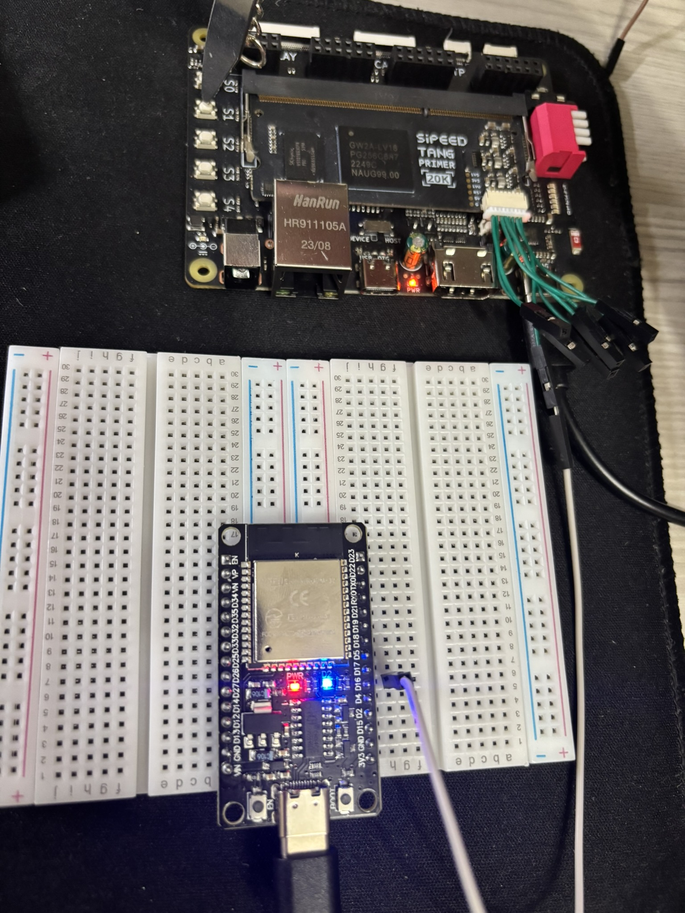
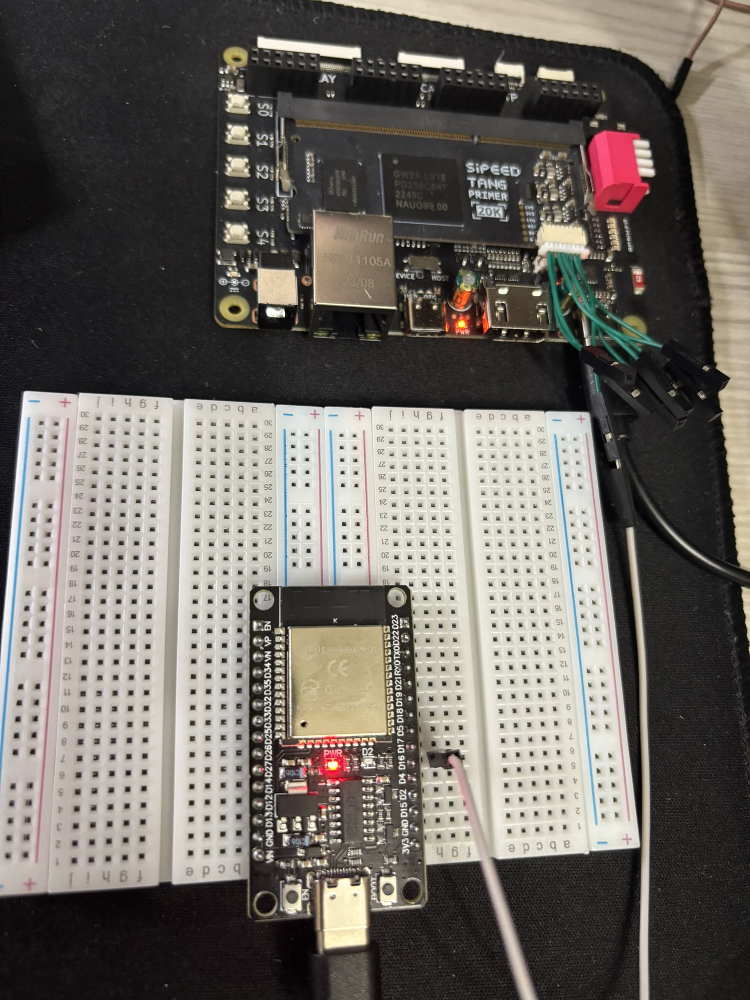

# UART (Universal asynchronous receiver-transmitter) protocol transmitter for the Sipeed Tang Primer 20k

Simple UART transmitter that can send serial data from the Primer 20k FPGA to a microcontroller. In this example, S1 on the board can toggle an LED on a microcontroller.

Verilog files are located under `tang primer 20k`

## ESP32

Connect `M11` (second pin from the right on the debugger pins) on the Primer to `G16` on the ESP32.
Ensure to program both boards before connection to avoid UART disruptions.

## ESP8266

Connect `M11` (second pin from the right on the debugger pins) on the Primer to `RX` on the ESP8266.
Ensure to program both boards before connection to avoid UART disruptions.
If this is your first time using the ESP8266, you may need [this driver](https://www.silabs.com/developer-tools/usb-to-uart-bridge-vcp-drivers?tab=downloads) to recognize it on your operating system 

## Arduino Uno R3

Connect `M11` (second pin from the right on the debugger pins) on the Primer to `0 (RX)` on the Uno.
Ensure to program both boards before connection to avoid UART disruptions.

## Notes

So far the only supported microcontrollers are the ESP32, ESP8266 and Arduino Uno. I ran into setup issues regarding the RP2040 but I'm hoping to get a file ready for it.

As most things are, this project is purely experimental!

## Gallery

*LED On*

*LED Off*